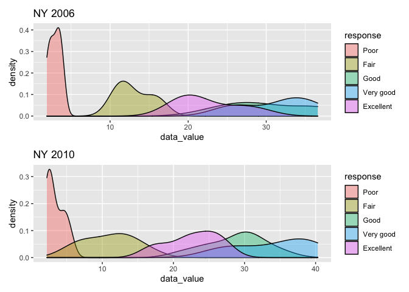
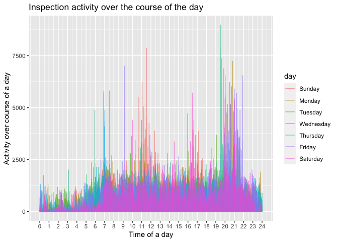

p8105\_hw3\_yg2762
================
Yang Gao
10/16/2021

``` r
library(tidyverse)
```

    ## ── Attaching packages ─────────────────────────────────────── tidyverse 1.3.1 ──

    ## ✓ ggplot2 3.3.5     ✓ purrr   0.3.4
    ## ✓ tibble  3.1.4     ✓ dplyr   1.0.7
    ## ✓ tidyr   1.1.3     ✓ stringr 1.4.0
    ## ✓ readr   2.0.1     ✓ forcats 0.5.1

    ## ── Conflicts ────────────────────────────────────────── tidyverse_conflicts() ──
    ## x dplyr::filter() masks stats::filter()
    ## x dplyr::lag()    masks stats::lag()

``` r
library(p8105.datasets)
library(patchwork)


knitr::opts_chunk$set(
  fig.width = 6,
  fig.asp = .6,
  out.width = "90%"
)
```

# Problem 1

load `instacart` dataset

``` r
data("instacart")
```

``` r
instacart %>% 
  group_by (aisle_id) %>% 
  summarise(n_obs = n()) %>% 
  mutate(aisle_rank = min_rank(n_obs)) %>% 
  arrange(desc(aisle_rank)) %>% 
  
  filter(n_obs > 10000) %>%
  ggplot(aes(x=aisle_id, y=n_obs)) + geom_point() + geom_line() +
  labs(
    title = "number of items ordered by aisle",
    x = "aisle_id",
    y = "number of items ordered") +
  scale_x_continuous(
    breaks = seq(0, 134, by=10))
```


``` r
instacart %>% 
  filter (aisle == c("baking ingredients", "dog food care", "packaged vegetables fruits")) %>% 
  group_by (aisle, product_name) %>% 
  summarise(number_of_order= n()) %>% 
  filter(min_rank(desc(number_of_order)) < 4) %>% 
  knitr::kable()
```

    ## `summarise()` has grouped output by 'aisle'. You can override using the `.groups` argument.

| aisle                      | product\_name                                   | number\_of\_order |
|:---------------------------|:------------------------------------------------|------------------:|
| baking ingredients         | Light Brown Sugar                               |               157 |
| baking ingredients         | Organic Vanilla Extract                         |               122 |
| baking ingredients         | Pure Baking Soda                                |               140 |
| dog food care              | Organix Chicken & Brown Rice Recipe             |                13 |
| dog food care              | Organix Grain Free Chicken & Vegetable Dog Food |                14 |
| dog food care              | Original Dry Dog                                |                 9 |
| packaged vegetables fruits | Organic Baby Spinach                            |              3324 |
| packaged vegetables fruits | Organic Blueberries                             |              1692 |
| packaged vegetables fruits | Organic Raspberries                             |              1920 |

``` r
instacart %>% 
  select(order_dow, order_hour_of_day,product_name) %>% 
  filter (product_name == c("Pink Lady Apples", "Coffee Ice Cream")) %>% 
  group_by(product_name, order_dow) %>% 
  summarise(mean_hour = mean(order_hour_of_day)) %>% 
  
  mutate(t_day_number = order_dow +1) %>% 
  mutate(order_dow = lubridate :: wday(t_day_number, label = TRUE)) %>% 
  select(-t_day_number) %>% 
  
  pivot_wider(
    names_from = order_dow,
    values_from = mean_hour
  ) %>% 
knitr::kable()
```

    ## Warning in product_name == c("Pink Lady Apples", "Coffee Ice Cream"): longer
    ## object length is not a multiple of shorter object length

    ## `summarise()` has grouped output by 'product_name'. You can override using the `.groups` argument.

| product\_name    |      Sun |      Mon |      Tue |     Wed |      Thu |      Fri |      Sat |
|:-----------------|---------:|---------:|---------:|--------:|---------:|---------:|---------:|
| Coffee Ice Cream | 13.22222 | 15.00000 | 15.33333 | 15.4000 | 15.16667 | 10.33333 | 12.35294 |
| Pink Lady Apples | 12.25000 | 11.67857 | 12.00000 | 13.9375 | 11.90909 | 13.86957 | 11.55556 |

There are 134 aisles in total, and users ordered the most items from
aisle 83.

# Problem 2

load the data

``` r
data("brfss_smart2010")
```

``` r
tidy_brfss =
  brfss_smart2010 %>% 
  janitor :: clean_names() %>% 
  filter(topic == "Overall Health") %>% 
  mutate(response = forcats::fct_relevel(response, c("Poor", "Fair", "Good", "Very good", "Excellent"))) 
```

``` r
tidy_brfss %>% 
  select(year, locationabbr,locationdesc, response, data_value) %>% 
  pivot_wider(
    names_from = response,
    values_from = data_value
  ) %>% 
  
  filter(year == 2002) %>% 
  group_by(locationabbr) %>% 
  summarize(locations = n()) %>% 
  filter(locations >= 7) %>% 
knitr::kable()
```

| locationabbr | locations |
|:-------------|----------:|
| CT           |         7 |
| FL           |         7 |
| MA           |         8 |
| NC           |         7 |
| NJ           |         8 |
| PA           |        10 |

``` r
tidy_brfss %>% 
  select(year, locationabbr,locationdesc, response, data_value) %>% 
  pivot_wider(
    names_from = response,
    values_from = data_value
  ) %>% 
filter(year == 2010) %>% 
  group_by(locationabbr) %>% 
  summarize(locations = n()) %>% 
  filter(locations >= 7) %>% 
knitr::kable()
```

| locationabbr | locations |
|:-------------|----------:|
| CA           |        12 |
| CO           |         7 |
| FL           |        41 |
| MA           |         9 |
| MD           |        12 |
| NC           |        12 |
| NE           |        10 |
| NJ           |        19 |
| NY           |         9 |
| OH           |         8 |
| PA           |         7 |
| SC           |         7 |
| TX           |        16 |
| WA           |        10 |

``` r
average_value =
 tidy_brfss %>% 
  filter (response =="Excellent") %>% 
  select(year,data_value, locationabbr, locationdesc) %>% 
  group_by (locationabbr, year) %>% 
  summarise(mean_data_value = mean(data_value))
```

    ## `summarise()` has grouped output by 'locationabbr'. You can override using the `.groups` argument.

``` r
ggplot(average_value, aes(x = year, y = mean_data_value), alpha=0.5) +geom_line(aes(group = locationabbr))
```

    ## Warning: Removed 3 row(s) containing missing values (geom_path).


``` r
response2006 = 
tidy_brfss %>% 
  filter(locationabbr =="NY", year== 2006) 
  ggplot(response2006, aes(y=data_value, x=response)) + geom_boxplot() +
   theme(legend.position = "none")
```



``` r
response2010 = 
tidy_brfss %>% 
  filter(locationabbr =="NY", year== 2010) 
  ggplot(response2010, aes(y=data_value, x=response)) + geom_boxplot() +
    theme(legend.position = "none")
```


# Problem 3

``` r
accel_df = read_csv("./accel_data.csv") %>% 
  janitor :: clean_names()
```

    ## Rows: 35 Columns: 1443

    ## ── Column specification ────────────────────────────────────────────────────────
    ## Delimiter: ","
    ## chr    (1): day
    ## dbl (1442): week, day_id, activity.1, activity.2, activity.3, activity.4, ac...

    ## 
    ## ℹ Use `spec()` to retrieve the full column specification for this data.
    ## ℹ Specify the column types or set `show_col_types = FALSE` to quiet this message.

``` r
accel_df %>% 
  mutate(day = forcats::fct_relevel(day, c("Sunday","Monday", "Tuesday", "Wednesday", "Thursday", "Friday","Saturday" ))) %>% 
  arrange (week,day) %>% 
  relocate(day_id, week, day) %>% 
  mutate(total_activity = select(., activity_1:activity_1440) %>% 
  rowSums()) %>% 
  select(week, day, total_activity) %>% 
  pivot_wider(
    names_from = day,
    values_from =total_activity
  ) 
```

    ## # A tibble: 5 × 8
    ##    week Sunday  Monday Tuesday Wednesday Thursday  Friday Saturday
    ##   <dbl>  <dbl>   <dbl>   <dbl>     <dbl>    <dbl>   <dbl>    <dbl>
    ## 1     1 631105  78828. 307094.   340115.  355924. 480543.   376254
    ## 2     2 422018 295431  423245    440962   474048  568839    607175
    ## 3     3 467052 685910  381507    468869   371230  467420    382928
    ## 4     4 260617 409450  319568    434460   340291  154049      1440
    ## 5     5 138421 389080  367824    445366   549658  620860      1440

``` r
accel_df %>% 
  select(-day_id) %>% 
  pivot_longer(
    activity_1:activity_1440,
    names_to = "time",
    names_prefix = "activity_",
    values_to ="activity"
  ) %>% 
  
ggplot(aes(x = as.numeric(time), color = day)) + geom_histogram()+
  facet_grid(.~ day)
```

    ## `stat_bin()` using `bins = 30`. Pick better value with `binwidth`.


